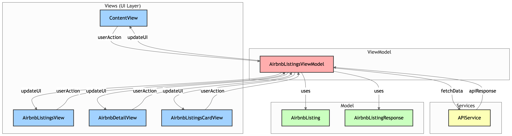

# 🏡 AIRBNB CLONE – iOS APP (SwiftUI)

A minimal yet powerful **Airbnb clone app** built using **SwiftUI**, following MVVM architecture. Users can browse listings, view detailed information, and enjoy a polished user interface powered by a clean service-driven data layer.

---

## ✨ FEATURES

- ✅ Built using **SwiftUI**
- ✅ Realistic listings UI with cards and detail views
- ✅ MVVM architecture for clean separation of concerns
- ✅ API service abstraction layer
- ✅ Custom models for parsing backend responses

---

## 🗺️ ARCHITECTURE DIAGRAM

---

## 📱 APP SCREENSHOTS

| Home View | Listings | Detail View |
|-----------|----------|-------------|
|  |  |  |

---

## 📁 PROJECT STRUCTURE

### 🔹 Views (UI Layer)

- [ContentView](https://github.com/akshat151/ios-app-airbnb-clone/blob/main/Airbnb/View/ContentView.swift)  
- [AirbnbListingsView](https://github.com/akshat151/ios-app-airbnb-clone/blob/main/Airbnb/View/AirbnbListingsView.swift)  
- [AirbnbDetailView](https://github.com/akshat151/ios-app-airbnb-clone/blob/main/Airbnb/View/AirbnbDetailView.swift)  
- [AirbnbListingsCardView](https://github.com/akshat151/ios-app-airbnb-clone/blob/main/Airbnb/View/AirbnbListingsCardView.swift)

### 🔹 ViewModel Layer

- [AirbnbListingsViewModel](https://github.com/akshat151/ios-app-airbnb-clone/blob/main/Airbnb/ViewModel/AirbnbListingsViewModel.swift)

### 🔹 Services

- [APIService](https://github.com/akshat151/ios-app-airbnb-clone/blob/main/Airbnb/Services/APIService.swift)

### 🔹 Model

- [AirbnbListing](https://github.com/akshat151/ios-app-airbnb-clone/blob/main/Airbnb/Model/AirbnbListing.swift)  
- [AirbnbListingResponse](https://github.com/akshat151/ios-app-airbnb-clone/blob/main/Airbnb/Model/AirbnbListingResponse.swift)

---

## 🧭 GETTING STARTED

### 🛠️ REQUIREMENTS

- Xcode 15+
- iOS 15+
- Swift 5+

### 🚀 LOCAL RUN

1. **Clone the repository**
2.	Open in Xcode
	  •	Double-click the .xcodeproj file or open via Xcode
3.	Build & Run
	  •	Choose a simulator or real device and run the app

---
📦 OPTIONAL SETUP
	•	APIService is mocked or abstracted for local JSON/API handling
	•	You can connect this to a real backend or Firebase with minimal updates to APIService.swift

---
✅ TESTING

This project can be extended with XCTest or Snapshot Testing for UI components.

To add tests:
	•	Create a test target if not present
	•	Write unit or UI tests for your ViewModels or Views

---
📚 LICENSE

This project is licensed under the MIT License. See the LICENSE file for more details.

---

🙌 CREDITS

Built by Akshat to explore SwiftUI architecture and real-world iOS patterns. Inspired by the layout and interactions of Airbnb.

---

Need help with:
	•	📲 Firebase integration
	•	🧪 UI snapshot testing
	•	📦 Swift Package modularization
Just ask!
